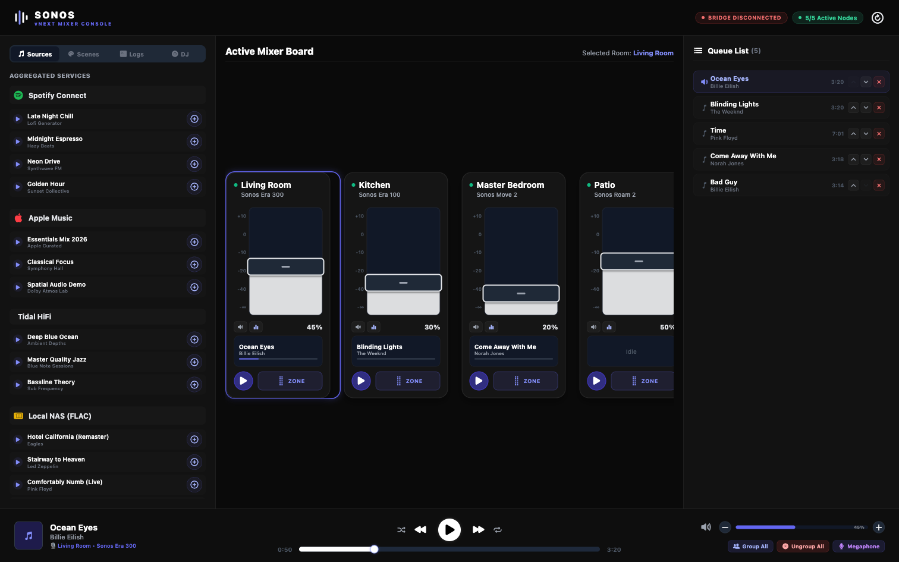

# Sonos vNEXT Mixer Console

A dark, high-density "mixing board" interface for controlling a multi-room Sonos speaker system — built as a faster, denser alternative to the official Sonos app.



> **The story.** I was waiting on a Sonos firmware update. It took about an hour. Somewhere in that hour of staring at a spinner I got fed up with the official app and asked Claude to build me a better interface. By the time the firmware finished updating, this app was already built and running — and it controlled my speakers more effectively than the Sonos app on my iPhone.
>
> This repo is that app, cleaned up and shared as an example of what you can build in the gaps.

It runs as an Expo / React Native app (web, iOS, Android). Out of the box it runs in **simulation mode** — a self-contained mock of SSDP discovery, UPnP SOAP control, and a CRDT sync engine, so you can explore the whole UI with zero hardware. Point it at the included **LAN bridge** and it drives real Sonos speakers on your network.

> **Unofficial project.** This is an independent, hobbyist project. It is **not affiliated with, endorsed by, or supported by Sonos, Inc.** "Sonos" is a trademark of its respective owner and is used here only to describe interoperability. Use at your own risk.

---

## What it does

- **3-pane mixing board** — media sources / live network logs on the left, vertical channel-strip faders in the center, play queue on the right.
- **Vertical faders** with optimistic UI: drag a fader and a translucent "ghost" shows the pending value while the hardware confirms, resolved by a per-speaker CRDT sync engine (800 ms temporal lockout) that prevents slider bounce.
- **Drag-and-drop zone grouping** — drag one channel's ZONE handle onto another to bond them into a group; group volume applies a proportional delta across members.
- **Global transport bar** — play/pause/skip, scrub bar with REL_TIME seek, master volume, mute, Group All / Ungroup All.
- **Per-speaker EQ** — bass, treble, loudness, night mode.
- **Scenes / presets** — snapshot volume + mute + EQ + zone topology and restore it later (persisted locally).
- **Turntable view** — a spinning-platter visualization of the now-playing track.
- **Megaphone** (web) — routes your mic straight to the device output via the Web Audio API, turning the machine into a quick PA.
- **Live topology + network log stream** with simulation controls (join speaker, lossy network, recover) when running without hardware.

## Two ways to run

| Mode | What you get | Requirements |
|------|--------------|--------------|
| **Simulation** (default) | The full UI driven by mocked discovery + a simulated state store. Great for exploring the interface or developing. | None — just the Expo app. |
| **Real LAN** | The same UI controlling actual Sonos players via the Node bridge. | Run `bridge/` on a machine on the same network as your speakers. |

### Run the app (simulation mode)

```bash
npm install
npm run web      # recommended for development
# or: npm run ios / npm run android
```

The app drops into simulation mode after a ~1.2s grace window if no bridge answers, seeding five demo speakers so the whole UI is usable. The header shows a `BRIDGE` badge — red/disconnected is expected until you start the bridge, and the browser console will log harmless `ws://localhost:8765` connection-refused retries in that state.

### Run against real speakers (LAN bridge)

The bridge is a small Node service that does real SSDP discovery and UPnP SOAP control via the [`sonos`](https://www.npmjs.com/package/sonos) library, then relays everything to the app over a WebSocket.

```bash
cd bridge
npm install
npm start        # or: npm run dev  (watch mode)
```

It listens on `ws://localhost:8765` (override with `PORT`). The app auto-connects with exponential backoff; the `BRIDGE` badge turns green once connected and real speakers appear in the mixer. Run the bridge on a host on the same LAN as your Sonos system.

## Architecture

```text
discoveryEngine (core/discovery.ts)        ← simulated SSDP/mDNS/cache + bridgeClient wiring
    │  merges simulated speakers with real topology from the bridge
    │  onTopologyChange → reconcileTopology
    ▼
stateStore (core/stateStore.ts)            ← optimistic UI state, LWW reconciliation,
    │                                          routes control RPCs to the bridge
    │  subscribe
    ▼
App.tsx → MainLayout → ChannelStrip / TransportBar / Turntable

syncEngine (core/syncEngine.ts)            ← per-speaker CRDT conflict resolver (800ms lockout)

bridgeClient (core/bridgeClient.ts) ⇄ ws ⇄ bridge/ (Node)  ← real Sonos LAN control
```

- **`core/`** — the engines: `discovery` (topology), `syncEngine` (CRDT), `stateStore` (orchestration), `bridgeClient` + `bridgeProtocol` (WebSocket RPC to the bridge), `megaphone` (Web Audio mic→speaker).
- **`components/`** — `MainLayout` (3-pane board), `ChannelStrip` (fader card), `TransportBar` (global controls), `Turntable` (platter view).
- **`bridge/`** — standalone Node service: SSDP discovery, UPnP SOAP control, GENA-style event relay, WebSocket RPC server.
- **`research.md`** — protocol reference (SSDP/mDNS, UPnP SOAP specs, Cloud API, CRDT math) used as the spec while building.

## Tech stack

- Expo SDK 54 / React Native 0.81, React 19, TypeScript (strict), new architecture enabled
- `@react-native-async-storage/async-storage` for persistence
- `@expo/vector-icons`
- Bridge: Node + `ws` + `sonos`, run with `tsx`

## Development

```bash
npx tsc --noEmit          # typecheck the app
cd bridge && npm run typecheck
```

There is no test runner, linter, or formatter configured. `CLAUDE.md` documents the architecture in more depth for AI-assisted contributors.

## Contributing

See [CONTRIBUTING.md](CONTRIBUTING.md). Contributions are welcome — this started as an hour-long experiment, so there's plenty of low-hanging polish (see "What Needs To Be Built Next" in `CLAUDE.md`).

## License

[MIT](LICENSE) © 2026 cdrguru
